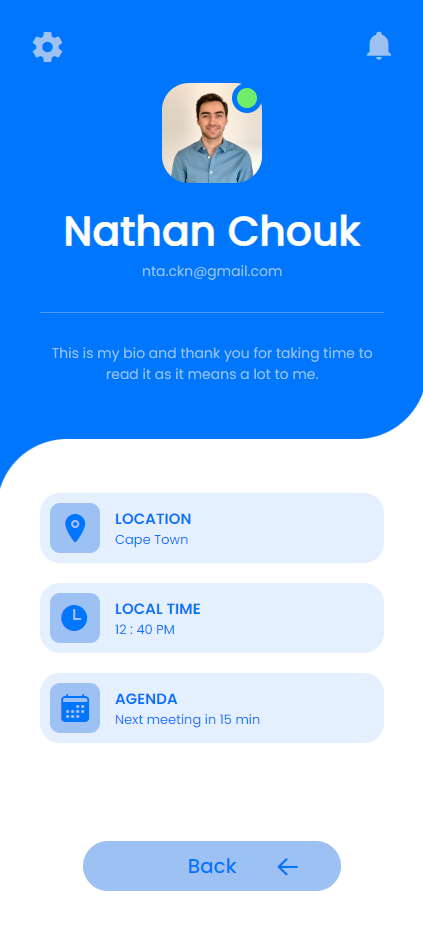
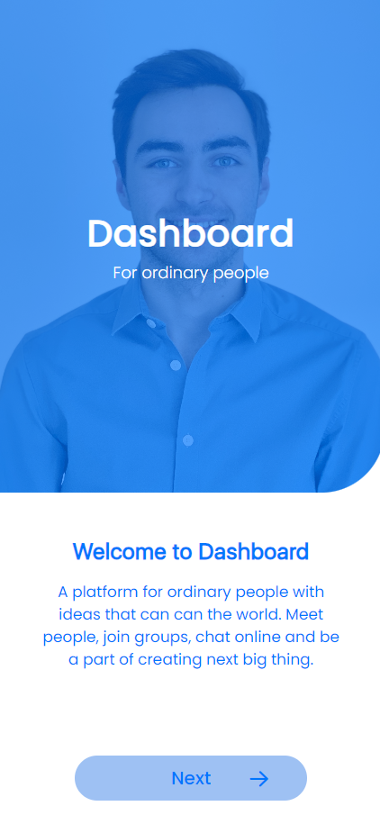
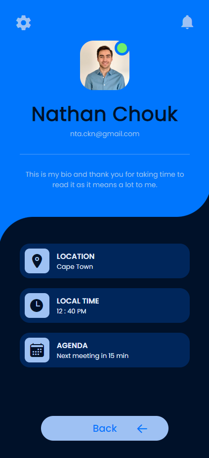
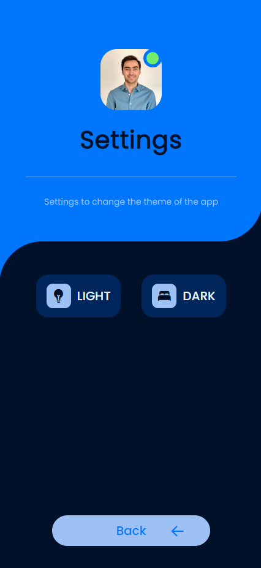

# AppDesign
Application design course projects A4S8

This react native application is a copy of a figma prototype with some added features. 

## Use the app
```
git clone the project 
cd AppDesign
npm install
npm start or npx expo start 
w (to start the web server)
```

## Project report
- **Choice of design**
For this project, I chose the first figma design. It is a representation of a profile application with two main screens: one introduction to the app and one profile page with information about the user. 
It has a main blue theme, large buttons and a list of information cards. The structure is pretty simple as there is no scrolling needed and only two parts of the app has a special background. 

- **What technology**
The developping is done in react native with javascript files and javascript styling. To add icons and useful methods, imports of packages are done with npm. The app uses a react native framework called expo, it helps us build and ship the app easily. 
The render was mainly cheked on web preview because of android run errors. 

- **How it has been done**
Navigation
To change pages by clicking on buttons, a navigation stack has been added. It is a react native navigation package that allows to create a stack of pages and navigate through them. The buttons can then redirect the screen to a different component page. 
Info cards 
For the information under the profile, the design looks like similar blocs where only the icon and the text changes. This part of code can be added as a component and reused as multiple times. To change the icon and text inside, props are added to the declaration and references a kind of component. The ```type``` prop give the title and the icon of the ```InfoCard```. The ```chilrdren``` prop gives the description and can be added inside the component tag. 
To better manage those cards, they are grouped in a ```CardGroup``` component and then imported as a part of the app. 

- **Bonus part**
settings and theme

As a bonus, a settings page has been added. it uses the profile page template and adds dark theme buttons. 
part of the template are: one cornered background, title and description styling and top page icons. 
The gear icon in the top of the profile page redirect to the settings page. 

thoses buttons trigger a react context change of state 
I have tried to contorle the theme colors without changing the styling i have defined from the beginning of the project. 
It made the use of theming harder as i cannot controle the js variable in the style file without putting them in a funtion. 

To improve the experience, the email adresse under the profil picture is clickable and linked to a new email. The adresse in the ```Text``` component is contained in a button that use the ```Linking``` package. The link is a ```mailto``` link that opens the default email app with the adresse as recipient.  


## Screenshots of the app






